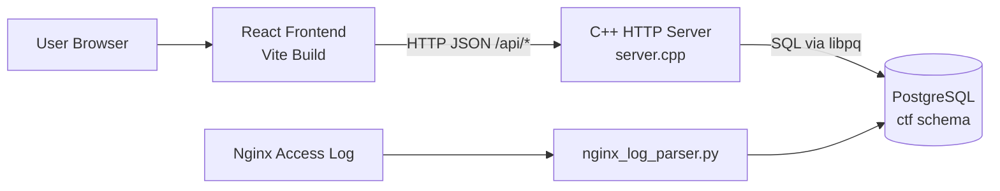
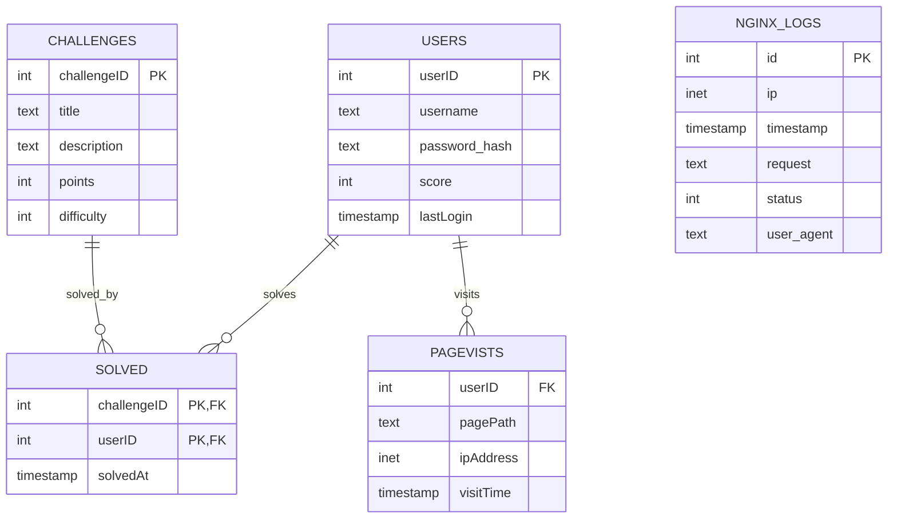
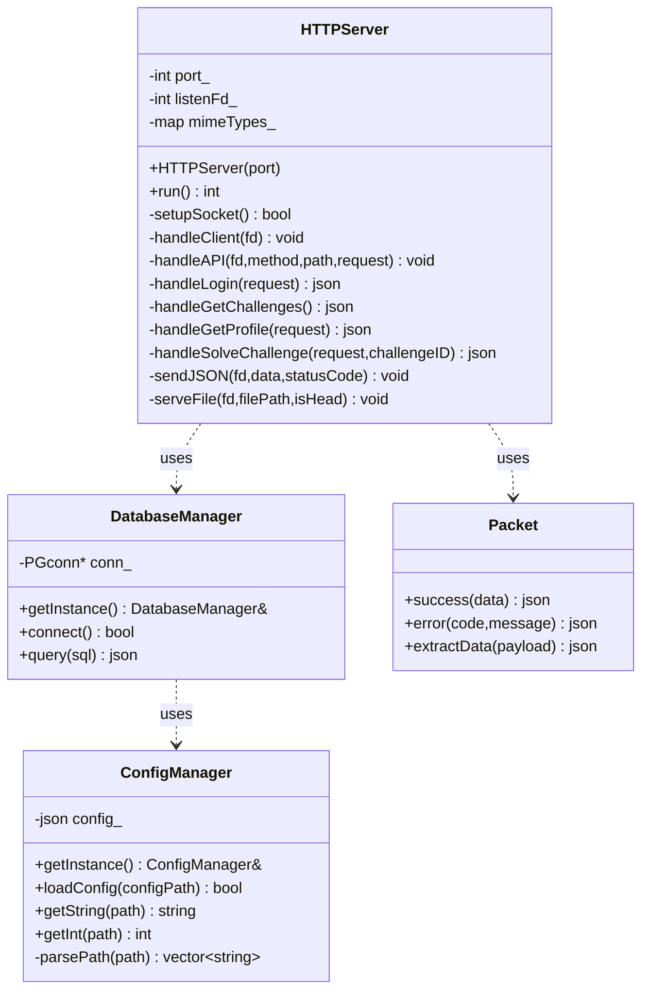
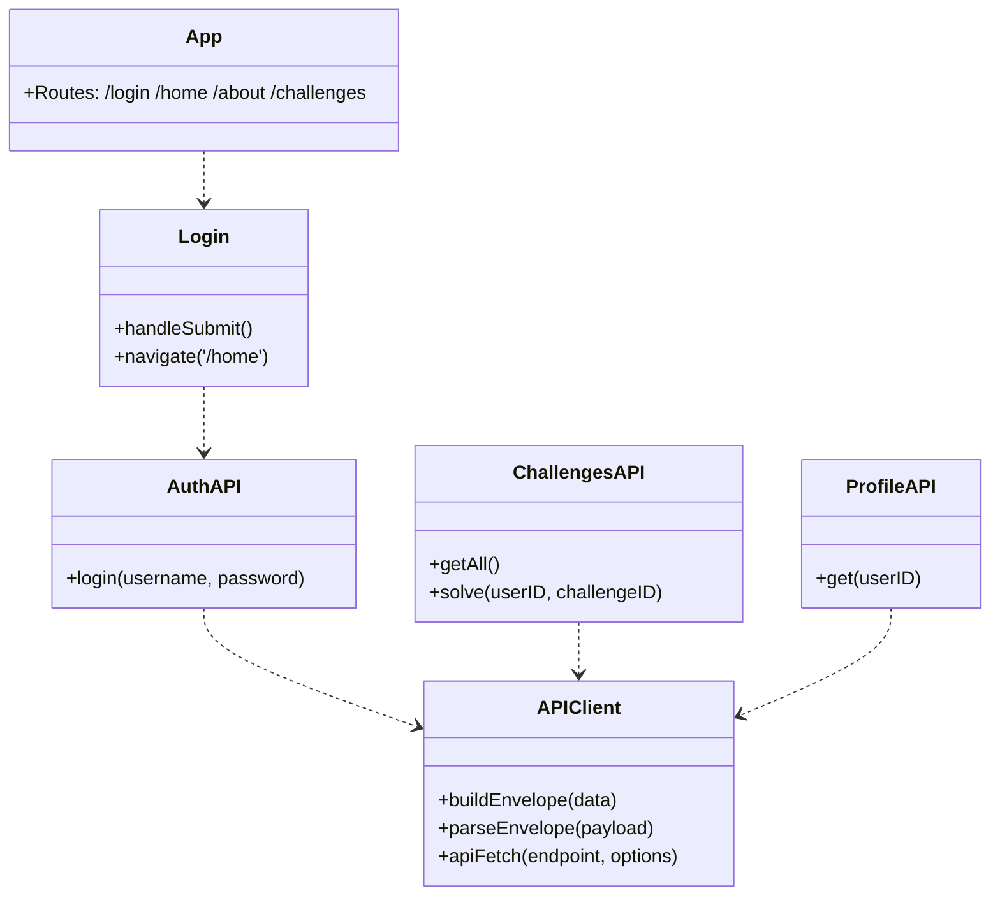
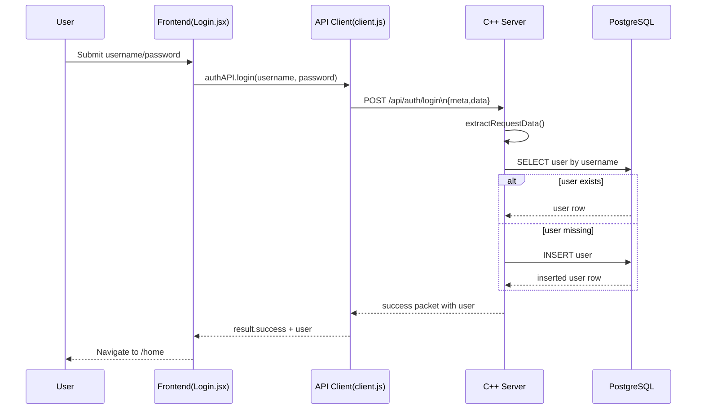
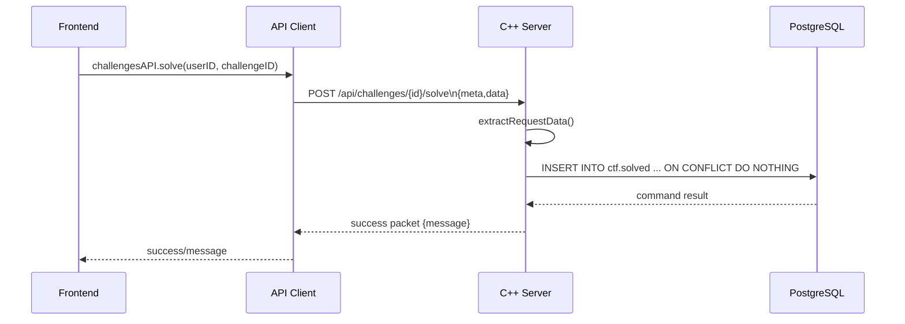
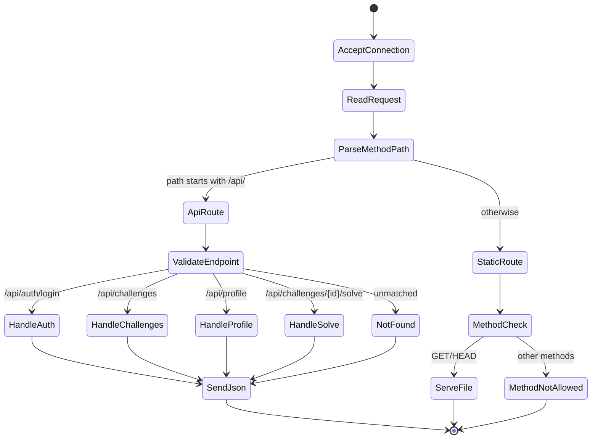
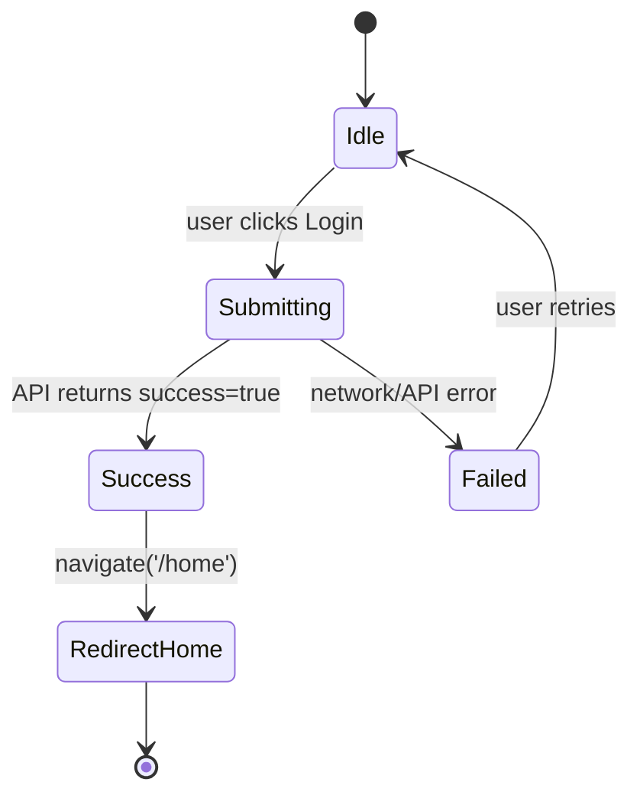

# Server-Client-CTFpi

## Overview
Server-Client-CTFpi is a Capture The Flag (CTF) web platform.

- Frontend: React + Vite client app
- Backend: C++ HTTP API server
- Database: PostgreSQL for users, challenges, and solve records
- Ops: Nginx access-log ingestion and Raspberry Pi deployment support

## Diagrams (Top)

### High-Level Architecture



### ER Diagram



### Backend UML Class Diagram



### Frontend UML Module Diagram



### Login Sequence Diagram



### Solve Challenge Sequence Diagram



### Backend Request State Flow



### Frontend Login State Flow



## Architecture
1. User logs in from the web frontend.
2. Frontend sends JSON requests to backend `/api/*` routes.
3. Backend processes logic and reads/writes PostgreSQL.
4. Backend returns JSON responses in a predefined packet structure.

## Tech Stack
- React 19, React Router, Vite
- C++ (CMake build)
- PostgreSQL (libpq)
- Python (nginx log parser/service scripts)
- Nginx + systemd

## Repository Layout
- `Backend/`: C++ server, DB config templates, nginx logger, deployment docs
- `Frontend/CTF/`: React frontend source and build config
- `db_config.example.json`: root database config template

## Quick Start
### 1. Backend dependencies
```bash
sudo apt update
sudo apt install build-essential cmake libpq-dev nlohmann-json3-dev postgresql
```

### 2. Database setup
```bash
psql -U postgres -d postgres
```
Create the `ctf` schema/tables from your setup SQL, then add test data if needed.

### 3. Backend config and build
```bash
cd Backend
cp ../db_config.example.json db_config.json
mkdir -p build
cd build
cmake ..
make
./bin/ctf_server
```

### 4. Frontend build
```bash
cd Frontend/CTF
npm install
npm run build
cp -r dist/* ../../Backend/build/
```

### 5. Open app
Visit:
- `http://localhost:8080`

## API Summary
- `POST /api/auth/login`
- `GET /api/challenges`
- `POST /api/challenges/{id}/solve`
- `POST /api/profile`

## Packet Structure (REQ20)
All client/server data should use this envelope:

```json
{
  "success": true,
  "meta": { "version": "1.0" },
  "data": {}
}
```

Error form:

```json
{
  "success": false,
  "meta": { "version": "1.0" },
  "error": { "code": "SOME_CODE", "message": "Details" }
}
```

## Detailed Docs
For full setup details, use:
- `SETUP.md`
- `Backend/README.md`
- `Backend/NGINX_SETUP.md`
- `Backend/RASPBERRY_PI.md`
- `Backend/DBEAVER_SETUP.md`
- `Frontend/CTF/README.md`
- `TECHNICAL_DOCUMENTATION.md` (SQL diagrams, UML, sequence diagrams, state flow charts)

## Current Status
- Core frontend/backend integration is present.
- Packet envelope helper exists in backend: `Backend/packet.h`.
- API client envelope handling exists in frontend: `Frontend/CTF/src/api/client.js`.


---

## Imported: SETUP.md

# CTF Platform - Full Setup Guide

This is a Proof-of-Concept CTF (Capture The Flag) platform with a React frontend and C++ PostgreSQL backend.

## Architecture

```
Frontend (React)          Backend (C++)              Database (PostgreSQL)
├── Login Page           ├── HTTP Server            ├── users
├── Dashboard            ├── API Routes             ├── challenges
├── Challenges           └── PostgreSQL Client      └── solved_challenges
├── About
└── Home
```

## Prerequisites

- Node.js 16+
- C++ compiler (g++, clang, or MSVC)
- CMake 3.10+
- PostgreSQL 12+
- nlohmann_json (C++ JSON library)
- libpq (PostgreSQL client library)

## Step 1: Database Setup

### Create PostgreSQL Schema

```bash
psql -U postgres -d postgres
```

Then run the SQL schema provided:

```sql
CREATE SCHEMA ctf;

CREATE TABLE ctf.users (
    userID SERIAL PRIMARY KEY,
    username TEXT NOT NULL UNIQUE,
    password_hash TEXT NOT NULL,
    score INT DEFAULT 0,
    lastLogin TIMESTAMP DEFAULT CURRENT_TIMESTAMP
);

CREATE TABLE ctf.challenges (
    challengeID SERIAL PRIMARY KEY,
    title TEXT NOT NULL,
    description TEXT,
    points INT DEFAULT 0,
    difficulty INT CHECK (difficulty BETWEEN 1 AND 3)
);

CREATE TABLE ctf.pageVists (
    userID INT REFERENCES ctf.users(userID),
    pagePath TEXT NOT NULL,
    ipAddress INET,
    visitTime TIMESTAMP DEFAULT CURRENT_TIMESTAMP
);

CREATE TABLE ctf.solved (
    challengeID INT REFERENCES ctf.challenges(challengeID),
    userID INT REFERENCES ctf.users(userID),
    solvedAt TIMESTAMP DEFAULT CURRENT_TIMESTAMP,
    PRIMARY KEY (challengeID, userID)
);
```

### Insert Test Data (Optional)

```sql
INSERT INTO ctf.users (username, password_hash, score) VALUES
('admin', 'admin123', 100),
('user1', 'pass1', 50),
('user2', 'pass2', 75);

INSERT INTO ctf.challenges (title, description, points, difficulty) VALUES
('Hello World', 'Create your first program', 10, 1),
('Buffer Overflow', 'Classic exploitation challenge', 50, 3),
('Web Security', 'Find the SQL injection vulnerability', 30, 2);
```

## Step 2: Backend Setup

### 1. Install Dependencies

**Ubuntu/Debian:**
```bash
sudo apt-get update
sudo apt-get install build-essential cmake libpq-dev nlohmann-json3-dev
```

**macOS:**
```bash
brew install cmake libpq nlohmann-json
```

**Fedora:**
```bash
sudo dnf install cmake gcc-c++ libpq-devel nlohmann_json-devel
```

### 2. Configure Database Connection

```bash
cd Backend
cp ../db_config.example.json db_config.json
```

Edit `db_config.json` with your PostgreSQL credentials:
```json
{
  "database": {
    "host": "localhost",
    "port": 5432,
    "user": "postgres",
    "password": "your_password",
    "dbname": "ctf",
    "schema": "ctf"
  },
  "server": {
    "port": 8080,
    "host": "0.0.0.0"
  }
}
```

### 3. Build the Server

```bash
mkdir build
cd build
cmake ..
make
```

### 4. Run the Server

```bash
./bin/ctf_server
```

You should see:
```
Connected to PostgreSQL database
HTTP Server listening on 0.0.0.0:8080
Serving files from: ./build
```

## Step 3: Frontend Setup

### 1. Install Dependencies

```bash
cd Frontend/CTF
npm install
```

### 2. Configure API Endpoint (Optional)

```bash
cp .env.example .env
```

Edit `.env` if your backend is on a different URL:
```
VITE_API_URL=http://localhost:8080/api
```

### 3. Build Frontend

```bash
npm run build
```

### 4. Copy Built Files to Backend

```bash
cp -r dist/* ../../Backend/build/
```

Then restart the backend server to serve the new version.

## Step 4: Testing

### Access the Application

1. Open browser: `http://localhost:8080`
2. Login with test credentials:
   - Username: `admin`
   - Password: `admin123`

### API Testing

Test endpoints with curl:

```bash
# Login
curl -X POST http://localhost:8080/api/auth/login \
  -H "Content-Type: application/json" \
  -d '{"username":"admin","password":"admin123"}'

# Get Challenges
curl http://localhost:8080/api/challenges

# Get User Profile
curl http://localhost:8080/api/profile?userID=1

# Solve Challenge
curl -X POST http://localhost:8080/api/challenges/1/solve \
  -H "Content-Type: application/json" \
  -d '{"userID":1}'
```

## File Structure

```
Server-Client-CTFpi/
├── Backend/
│   ├── server.cpp              # Main server implementation
│   ├── CMakeLists.txt          # Build configuration
│   ├── db_config.json          # DB credentials (gitignored)
│   ├── db_config.example.json  # Config template
│   ├── README.md               # Backend docs
│   └── build/                  # Compiled output & static files
│
├── Frontend/CTF/
│   ├── src/
│   │   ├── pages/
│   │   │   ├── Home.jsx       # Home page
│   │   │   ├── About.jsx      # About page
│   │   │   ├── Challenges.jsx # Challenges listing
│   │   │   ├── Login.jsx      # Login form
│   │   │   ├── Dashboard.jsx  # User dashboard
│   │   │   └── *.css          # Styles
│   │   ├── components/
│   │   │   └── Header.jsx     # Navigation header
│   │   ├── api/
│   │   │   └── client.js      # API client functions
│   │   ├── App.jsx            # Main app component
│   │   └── main.jsx           # React entry point
│   ├── package.json           # Frontend dependencies
│   ├── vite.config.js         # Vite configuration
│   ├── .env.example           # Environment template
│   └── dist/                  # Built output
│
├── db_config.example.json     # Root config template
└── README.md                  # Project documentation
```

## Development Workflow

### Making Changes

1. **Frontend Changes:**
   ```bash
   cd Frontend/CTF
   npm run dev  # Dev server at http://localhost:5173
   ```

2. **Backend Changes:**
   - Edit `Backend/server.cpp`
   - Rebuild: `cd Backend/build && cmake .. && make`
   - Restart server: `./bin/ctf_server`

3. **Deploy:**
   ```bash
   # Build frontend
   cd Frontend/CTF && npm run build
   
   # Copy to backend
   cp -r dist/* ../../Backend/build/
   
   # Commit changes
   git add .
   git commit -m "Update CTF platform"
   git push
   ```

## Troubleshooting

### PostgreSQL Connection Failed
- Check `db_config.json` database credentials
- Verify PostgreSQL is running: `psql -U postgres`
- Check firewall allows port 5432

### CMake Not Found
```bash
# Ubuntu
sudo apt-get install cmake

# macOS
brew install cmake

# Check version
cmake --version
```

### Frontend Not Loading
- Verify `npm run build` completed successfully
- Check files copied to `Backend/build/`
- Ensure backend is serving from correct directory

### CORS Issues
- Backend already allows `Access-Control-Allow-Origin: *`
- If still issues, verify API URL in frontend `.env`

## Security Notes

- This is a **PoC** - not production-ready
- Passwords stored as plain text (use bcrypt in production)
- SQL injection protection is basic (use prepared statements)
- No HTTPS configured
- No rate limiting or DDoS protection
- Add proper authentication/session management for production

## Next Steps

1. Add bcrypt for password hashing
2. Implement JWT tokens for sessions
3. Use prepared statements for SQL queries
4. Add input validation/sanitization
5. Implement proper error handling
6. Add unit and integration tests
7. Set up CI/CD pipeline
8. Deploy to production server

## Support

For issues or questions, check:
- Backend logs in terminal output
- Browser console (F12) for frontend errors
- PostgreSQL logs: `psql -U postgres -c "SELECT * FROM pg_log;"`

---

**Built with React, C++, and PostgreSQL**


---

## Imported: TECHNICAL_DOCUMENTATION.md

# Technical Documentation

## 1. System Overview

Server-Client-CTFpi is a CTF platform composed of:
- React frontend (`Frontend/CTF`) for user interaction
- C++ backend (`Backend/server.cpp`) for HTTP routing and API logic
- PostgreSQL database (`ctf` schema) for application data
- Nginx access log ingestion (`Backend/nginx_log_parser.py` + `Backend/nginx_logs_schema.sql`)

## 2. High-Level Architecture


## 3. API Contract (REQ20 Packet)

All client-server payloads follow a predefined envelope.

### Success Packet

```json
{
  "success": true,
  "meta": { "version": "1.0" },
  "data": {}
}
```

### Error Packet

```json
{
  "success": false,
  "meta": { "version": "1.0" },
  "error": {
    "code": "ERROR_CODE",
    "message": "Human-readable message"
  }
}
```

### Backend Packet Utility
- Defined in `Backend/packet.h`
- `ctf::Packet::success(data)`
- `ctf::Packet::error(code, message)`
- `ctf::Packet::extractData(payload)`

## 4. API Endpoints

| Method | Endpoint | Purpose |
|---|---|---|
| POST | `/api/auth/login` | Login/register-like flow and return user profile |
| GET | `/api/challenges` | Retrieve challenge list |
| POST | `/api/challenges/{id}/solve` | Mark challenge as solved for user |
| POST | `/api/profile` | Retrieve user profile by `userID` |

## 5. SQL Data Model

The project uses tables from setup documentation plus Nginx log schema in repo.

### 5.1 ER Diagram (Database)


### 5.2 Operational Log Schema (from `Backend/nginx_logs_schema.sql`)

```sql
CREATE TABLE ctf.nginx_logs (
    id SERIAL PRIMARY KEY,
    ip INET,
    timestamp TIMESTAMP DEFAULT NOW(),
    request TEXT,
    status INT,
    user_agent TEXT
);

CREATE INDEX idx_nginx_ip ON ctf.nginx_logs(ip);
CREATE INDEX idx_nginx_time ON ctf.nginx_logs(timestamp);
```

## 6. UML Documentation

### 6.1 Backend Class Diagram


### 6.2 Frontend Module UML


## 7. Sequence Diagrams

### 7.1 Login Sequence


### 7.2 Solve Challenge Sequence


## 8. State Flow Charts

### 8.1 Request Processing State Flow (Backend)


### 8.2 Login UI State Flow (Frontend)


## 9. Security and Risk Notes

- Passwords are currently persisted as plain text (`password_hash` stores raw input in current flow).
- SQL query strings are dynamically concatenated; escaping exists but prepared statements are preferred.
- Packet contract versioning exists (`meta.version`), but strict version validation is not enforced.
- CORS allows all origins (`Access-Control-Allow-Origin: *`) for development convenience.

## 10. Suggested Documentation Extensions

- OpenAPI spec for `/api/*` endpoints
- Deployment diagram for Nginx + systemd + backend process lifecycle
- Threat model (STRIDE) for authentication and challenge submission paths
- Migration plan to password hashing (bcrypt/argon2)
